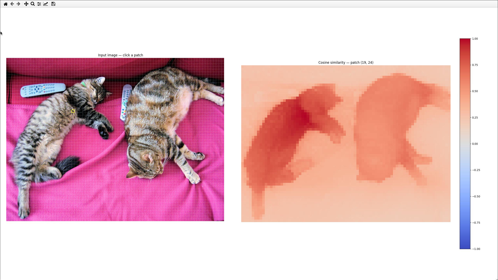

# DINOv3 Image Segmentation 
This app demonstrates unsupervised image segementation. DINOv3 has never seen any textual labelings - it learned exclusively by viewing images. Using this model we can generate vectors which are close to each other in the model's embedding space if the object is the same object, and further away if it is a different object. 

